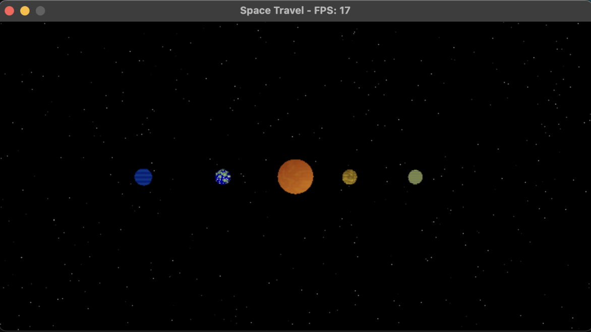

# graphics-proyecto_1
Simulación del sistema solar usando un software renderer diseñado por mí. 
Ejemplo: http://mgvez.github.io/jsorrery/

## Objetivos
- Renderizar al menos un sol y varios planetas que se alienen a un plano eclíptico.
- Los planetas deben trasladarse en una órbita (puede ser circular) y deben rotar sobre su eje.
- Implementar una cámara que se pueda mover entre los modelos de planetas.

# Sistema solar creado

# Video del sistema solar
<video width="640" height="360" controls>
  <source src="readme-media/solar-system.mov" type="video/mov">
  Your browser does not support the video tag.
</video>

**Enlace a mi video** 
[Click aqui](readme-media/solar-system.mov)

#### Rúbrica

| Puntos | Descripción                     |
| :-------- | :-------------------------------- |
| `30 pts`  | Estética, escena del sistema solar bonita |
| `20 pts`  | Performance de la escena completa. No es necesario mantener 60 frames por segundo |
| `50 pts`  | Puntos por cada planeta / estrella / luna en el sistema |
| `10 pts`  | Crear un skybox que muestre estrellas en el horizonte |
| `10 pts`  | Implementar condicionales que eviten que la nave/camara atraviese los elementos de su sistema solar |
| `10 pts`  | 40 puntos por implementar movimiento 3D para la cámara |

**Total:** 130 pts

